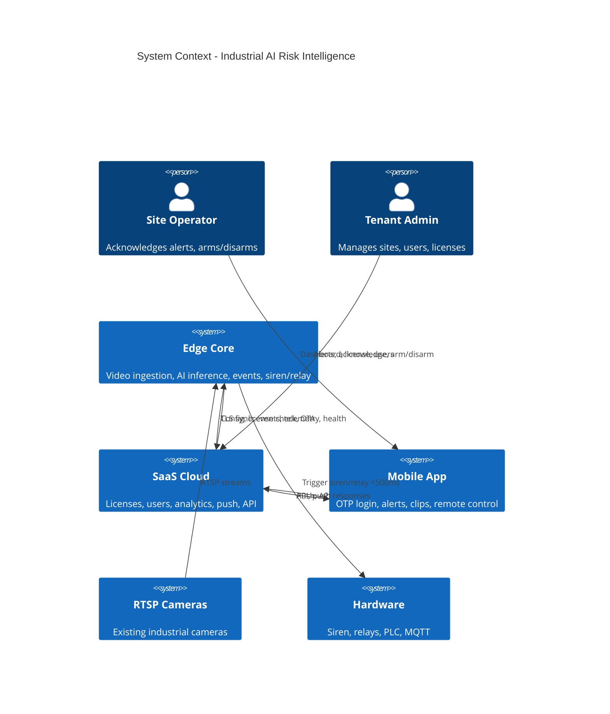
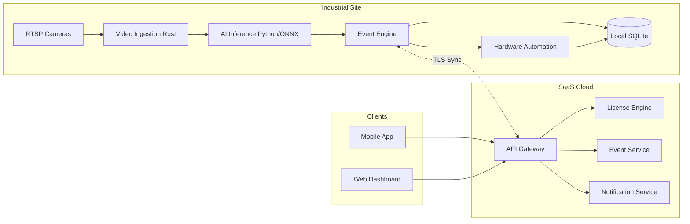
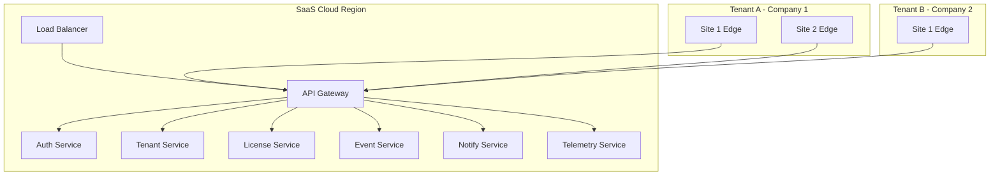

# Global System Architecture

## 1. System Context

## 2. Global Data Flow

## 3. Deployment Topology

## 4. Edge Stack (Single Site)

| Layer | Technology | Responsibility |
|-------|------------|----------------|
| Video ingestion | Rust | RTSP pull, decode, frame queue, multi-camera, HW decode, memory cap |
| AI inference | Python + ONNX Runtime GPU | Batch inference, ROI, thresholds, hot reload |
| Event engine | Rust/Python | Multi-frame validation, risk score, zones, schedule, dedup |
| Hardware | Rust/C | Relay, siren, MQTT, Modbus, <500ms path |
| Local store | SQLite (encrypted) | Clips, snapshots, audit, rotation |
| Sync client | Rust | TLS to cloud, backoff, certificate pinning |

## 5. Cloud Stack (Multi-Tenant)

| Concern | Implementation |
|---------|----------------|
| API | REST + WebSocket (real-time); API Gateway + rate limit |
| Auth | JWT; OTP via SMS; device binding; max 5 phones per license |
| Tenancy | Tenant ID on every entity; row-level isolation |
| License | 14-day trial offline; device ID binding; anti-clock tamper; feature flags |
| Events | Ingest from edge; aggregate; push to mobile; escalation |
| Telemetry | Device health, latency, model version; Prometheus |

## 6. Mobile Stack

| Item | Choice |
|------|--------|
| Framework | Flutter |
| Auth | OTP (phone); JWT in secure storage |
| Real-time | FCM + WebSocket fallback |
| Features | Multi-site, snapshot, 10s clip, ack, escalate, remote siren, arm/disarm |

---

*Next: [Cloud SaaS Architecture](02-cloud-saas-architecture.md)*
