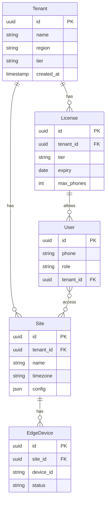
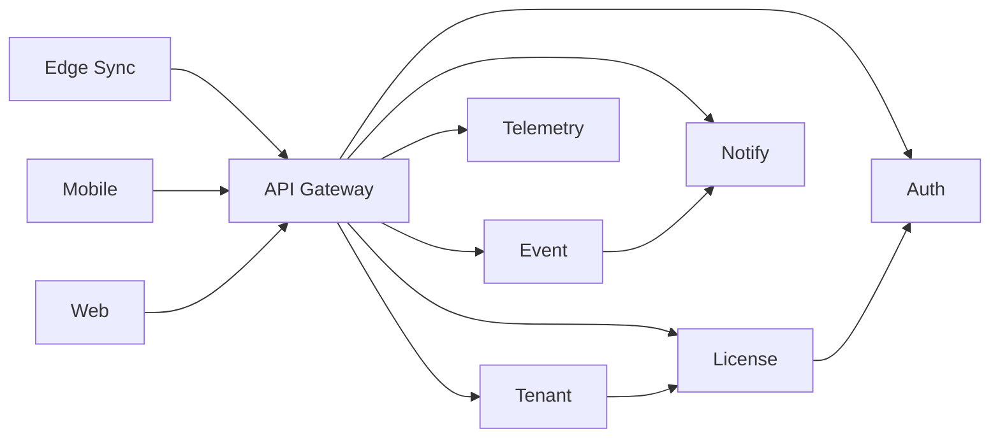

# Cloud SaaS Architecture

## 1. Multi-Tenant Model

- **Tenant** = Company (billing, isolation boundary).
- **Site** = Factory/warehouse; multiple edge devices per site.
- **License** = Tier, expiry, max phones, feature flags; bound to tenant.
- **User** = Phone + OTP; roles: Admin, Security, Manager, Viewer; max 5 phones per license.

## 2. Microservices Map

| Service | Responsibility | Scale |
|---------|----------------|-------|
| **api-gateway** | Routing, rate limit, TLS termination, tenant header | Horizontal |
| **auth-service** | OTP send/verify, JWT issue/validate, device binding | Horizontal |
| **tenant-service** | CRUD tenant, site, edge device; tenant context | Horizontal |
| **license-service** | Activation, trial, expiry, feature flags, device binding | Horizontal |
| **event-service** | Ingest edge events, store, aggregate, risk score | Horizontal + partition by tenant |
| **notification-service** | Push (FCM), SMS escalation, in-app | Horizontal |
| **telemetry-service** | Device health, metrics, alerts | Horizontal |
| **analytics-service** | Risk aggregation, reports, insurance export | Horizontal |

## 3. Service Communication

- Sync: Edge → Gateway → Event / Telemetry (and License for periodic check).
- Mobile/Web: Gateway → Auth (JWT) → Tenant, License, Event, Notify.

## 4. License Engine (High Level)

- **Trial**: 14 days from first edge activation; works fully offline; no clock tamper (signed time + NTP when online).
- **Activation**: Activation key → tenant; device_id bound to license; max devices per tier.
- **Feature flags**: Fire-only, Fire+Theft, Multi-site, ERP, etc., driven by tier.
- **Expiry**: Soft warning before expiry; hard block after; grace period configurable.
- **Phones**: Max 5 per license; stored and enforced in auth + tenant.

## 5. Key Non-Functional Requirements

| Requirement | Target |
|-------------|--------|
| Tenant isolation | No cross-tenant data leak; tenant_id on all queries |
| API latency (p95) | < 200 ms for read APIs |
| Event ingestion | < 5 s from edge to push to mobile |
| Availability | 99.9% for API and event ingestion |
| Scale | 10,000 sites; 100k+ edge devices |

---

*Next: [Database Schemas](../schemas/README.md). Full index: [DELIVERABLES-INDEX.md](../DELIVERABLES-INDEX.md).*
