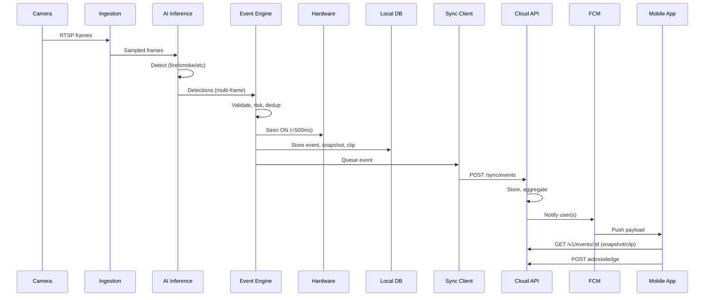
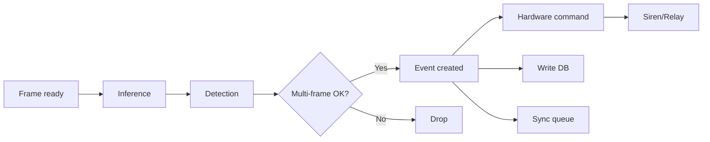
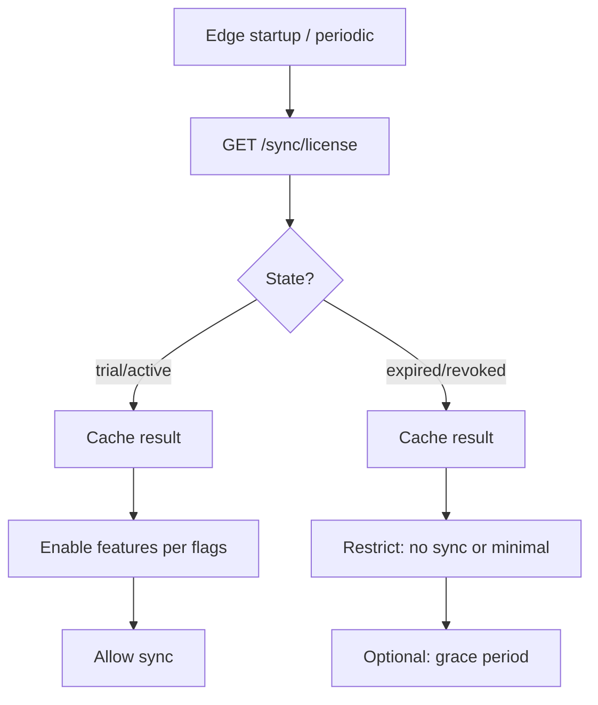
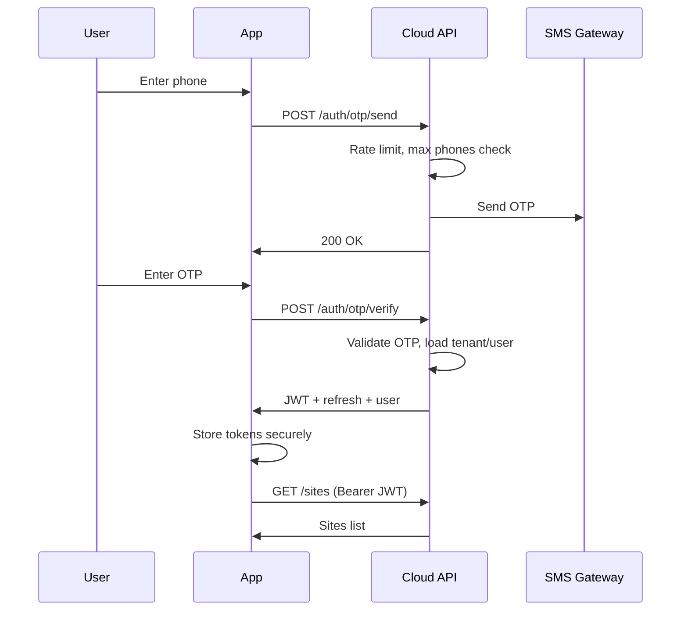

# Event Flow Diagrams

## 1. End-to-End Event Flow (Edge → Cloud → Mobile)

## 2. Edge Internal Event Path (Latency-Critical)

**Timing**: Frame → Inference (~50–100 ms) → Multi-frame (1–2 frames) → Command → Relay (~50 ms) → **Total < 500 ms**.

## 3. License Check and Feature Gating (Edge)

## 4. OTP Login and JWT (Mobile/Web)

