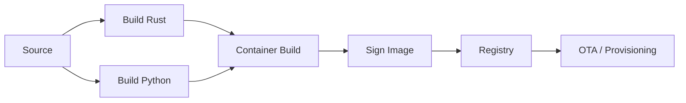
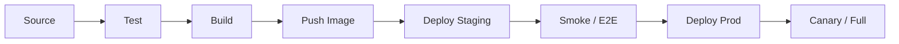

# CI/CD Pipeline

## 1. Scope

| Component | Repo / Build | Deploy |
|-----------|--------------|--------|
| Edge agent (Rust + Python) | Single image or two (ingestion + inference) | Docker → OTA or USB |
| Cloud services | Monorepo or per-service | Kubernetes (or ECS) |
| Mobile (Flutter) | Single repo | App Store / Play Store / internal |
| API Gateway, shared libs | In cloud repo | With cloud deploy |

## 2. Pipeline Stages

### Edge

- **Build**: Rust (release, target for arm64/x86_64); Python worker (dependency freeze).
- **Test**: Unit tests (Rust, Python); integration test with mock RTSP and mock inference.
- **Container**: Multi-stage Dockerfile; minimal base (Alpine or distroless).
- **Sign**: Image signing (e.g. cosign); verification on edge before apply.
- **Deploy**: Push to registry; OTA service pulls and updates edge devices (staged rollout).

### Cloud

- **Test**: Unit, integration; DB migrations tested in CI.
- **Build**: Per-service Docker images; tag with commit SHA.
- **Staging**: Auto-deploy on main; run smoke and E2E (API, auth, sync).
- **Prod**: Manual approval or auto after staging green; canary then full rollout.
- **Rollback**: Previous image re-deploy; DB migrations backward-compatible where possible.

### Mobile

- **Build**: Flutter build (iOS/Android); version from tag or env.
- **Test**: Unit + widget tests; optional integration.
- **Deploy**: Fastlane or CI step to upload to TestFlight / Play Internal; store submission manual or scheduled.

## 3. Environments

| Env | Purpose |
|-----|---------|
| dev | Developer; shared or local |
| staging | Pre-production; mirrors prod config; E2E |
| production | Live tenants; multi-region if needed |

## 4. Secrets

- **CI**: Secrets in vault (e.g. GitHub Actions secrets, Vault); never in repo.
- **Cloud**: Runtime secrets from KMS or vault; injected at deploy.
- **Edge**: Device cert and API key in secure storage (TPM or encrypted disk).

## 5. Key Files (Reference)

- `Dockerfile.edge` — Edge image.
- `Dockerfile.api` — API gateway / services.
- `.github/workflows/edge.yml` — Edge CI.
- `.github/workflows/cloud.yml` — Cloud CI.
- `k8s/` — Kubernetes manifests (or Terraform for ECS).
