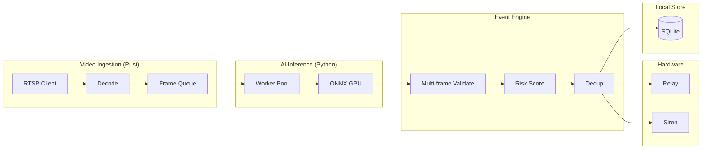

# Edge Core Engine Specification

## 1. Pipeline Overview

**Latency target**: Camera frame → siren trigger < 500 ms (p99).

---

## 2. Video Ingestion Layer (Rust)

### Responsibilities

- Connect to multiple RTSP cameras in parallel.
- Decode frames (hardware decode preferred: NVENC, VAAPI, etc.).
- Output to shared frame queue(s) per camera or global with camera_id.
- Configurable FPS sampling (e.g. 2 FPS per camera to reduce load).
- Memory cap: max frames in queue; drop oldest or skip on overflow.
- Crash recovery: auto-reconnect on disconnect; exponential backoff.
- No GPU readback for decode → inference handoff where possible (GPU buffer pass).

### Config (from cloud or local)

- Per camera: `rtsp_url`, `fps_sample`, `resolution` (optional), `hw_decode`: bool.
- Global: `max_queue_frames`, `reconnect_delay_ms`, `max_reconnect_attempts`.

### Output

- Frames with `camera_id`, `timestamp`, `buffer` (GPU or CPU).
- Backpressure: if downstream (AI) is slow, drop or reduce FPS per camera.

---

## 3. AI Inference Layer (Python + ONNX)

### Stack

- **ONNX Runtime** with GPU execution provider (CUDA/ROCm).
- **Models**: Fire/smoke, intrusion/loitering (separate or combined); versioned (e.g. `fire_v2.1.onnx`).
- **Batch inference**: Collect N frames (across cameras or per camera) → single GPU run.
- **Worker pool**: Multiple processes or threads; one GPU per process or shared with lock.

### Per-Camera / Per-Model

- **ROI masking**: Only run inference on region of interest (polygon or mask image).
- **Threshold**: Confidence threshold per model (e.g. 0.7); configurable.
- **Hot reload**: Load new model path or version on config change without full restart.
- **Model versioning**: Report `model_version` in telemetry and event payload.

### Backpressure

- If frame queue grows beyond limit, ingestion drops frames; inference always consumes from queue with bounded concurrency.

### Output

- Per-frame (or per batch) detections: `camera_id`, `model`, `class`, `confidence`, `bbox` (optional), `timestamp`.

---

## 4. Event Engine

### Multi-Frame Validation

- **Fire/smoke**: Require K consecutive frames (e.g. 2–3) above threshold before emitting event; reduces false positives.
- **Intrusion/loitering**: Same idea; optional persistence (N seconds in zone).
- **Confidence smoothing**: Running average or temporal filter before threshold.

### Risk Scoring

- **Per event**: Base score from model confidence and class (e.g. fire = 90, smoke = 70); adjust by zone (restricted zone = +10).
- **Aggregate**: Optional site-level rolling score (e.g. last 24h) for escalation.

### Zone Mapping

- Each camera can have polygons (zones); detection only counts if inside enabled zone.
- Schedule: Optional time windows when zones are active (e.g. after hours for intrusion).

### Escalation Tree

- Priority: critical → high → medium → low.
- Critical (e.g. fire): immediate siren + push.
- Escalation rules (e.g. 2nd event in 5 min → escalate) can be config-driven; full tree in cloud, edge applies local rules from config.

### Alert Deduplication

- Same camera + same type + within T seconds (e.g. 60) → one event; extend existing or drop duplicate.
- Event ID: UUID or `camera_id + type + first_trigger_ts` for idempotency in cloud.

### Output

- **Event**: event_id, type, priority, risk_score, camera_id, zone_id, snapshot_ref, clip_ref, payload, occurred_at.
- **Actions**: Trigger hardware (siren/relay); write to local SQLite; enqueue for sync.

---

## 5. Real-Time Hardware Automation

### Latency Requirement

- < 500 ms from event decision to relay/siren actuation.
- Path: Event engine → hardware driver → GPIO/Serial/MQTT/Modbus.

### Supported Interfaces

| Interface | Use case |
|-----------|----------|
| GPIO / Relay | Direct siren, relay boards |
| MQTT | Smart relays, home/industrial automation |
| Modbus RTU/TCP | PLC, industrial panels |
| GSM module | Fallback alert (SMS) if cloud down |

### Implementation

- Dedicated process or thread; no blocking I/O in event engine.
- Command queue: “siren on”, “relay 1 on”, etc.; executed in order; timeout per command.
- **Alarm panel compatibility**: Dry contact or protocol adapter (e.g. Contact ID over IP) if required.

### Audit

- Every hardware action logged to `hardware_actions` with event_id, action_type, triggered_at, latency_ms, success.

---

## 6. Local Data Management

- **SQLite**: Encrypted (e.g. SQLCipher); schema as in [04-edge-local.sql](../schemas/04-edge-local.sql).
- **Signed timestamps**: For critical fields (e.g. event occurred_at), optional HMAC with device key for integrity.
- **Clips**: Encode 10 s around event; store path in DB; rotation: keep last N or by size; delete oldest.
- **Snapshots**: JPEG at event time; same rotation policy.
- **Health**: Periodic self-check (disk, queue depth, inference latency); report in telemetry.

---

## 7. Sync Client (Rust)

- **TLS**: Client certificate + API key; certificate pinning to cloud.
- **Config pull**: GET /sync/config on interval or on startup; apply to ingestion + AI + event engine.
- **Event push**: POST /sync/events in batches; mark `synced_at` after 202.
- **Telemetry push**: POST /sync/telemetry on interval.
- **License**: GET /sync/license; cache and enforce features/expiry.
- **Backoff**: On 5xx or network error, exponential backoff; do not block local detection/siren.

---

*Next: [AI Modules](02-ai-modules.md)*
