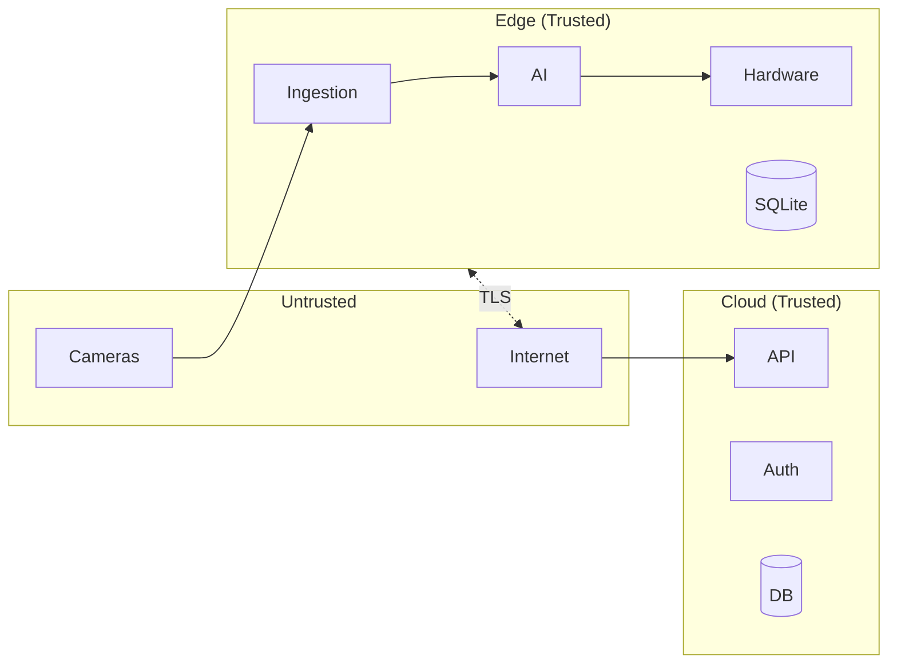

# Threat Model

## 1. Assets

| Asset | Location | Sensitivity |
|-------|----------|-------------|
| Video streams | Edge only (not stored in cloud) | High |
| Event data (type, time, snapshot/clip refs) | Edge + Cloud | High |
| User credentials (phone, OTP) | Cloud | Critical |
| License & activation keys | Cloud + Edge cache | Critical |
| Device identity (cert, API key) | Edge + Cloud | High |
| Tenant/site/config | Cloud + Edge | Medium |
| Audit logs | Edge + Cloud | High (integrity) |

## 2. Trust Boundaries

- **Cameras**: Untrusted; RTSP can be spoofed or tampered; treat as untrusted input.
- **Edge**: Trusted operator environment; physical security assumed; device cert and key must be protected.
- **Cloud**: Trusted; assume compromise of one tenant must not leak others.
- **Mobile**: Semi-trusted; secure storage for tokens; device binding optional.

## 3. Threat Actors & Mitigations

| Actor | Goal | Mitigation |
|-------|------|------------|
| **External attacker** | Access API, steal data | TLS everywhere; rate limit; intrusion detection on API; JWT short-lived; no video in cloud |
| **Malicious tenant** | Access other tenants’ data | Strict tenant_id isolation; no cross-tenant queries; RBAC |
| **Insider (cloud)** | Export tenant data | Audit logging; least privilege; encryption at rest |
| **Camera compromise** | Inject fake video | Edge validates stream; tamper detection (darkness, blur); optional camera auth |
| **Edge device theft** | Reuse device on another tenant | Device bound to license; revoke from cloud; cert revocation |
| **Clock tampering (trial)** | Extend trial | Signed time from NTP when online; heartbeat; anomaly on large backward jump |
| **License bypass** | Run without paying | Device activation; periodic license check; offline grace window (e.g. 7 days) then restrict |
| **SMS/OTP abuse** | Account takeover | Rate limit OTP send; max 5 phones per license; device binding; revoke capability |
| **Firmware/OTA** | Malicious update | Signed firmware; secure boot; hash verification; staged rollout |

## 4. Security Controls Summary

| Control | Implementation |
|---------|----------------|
| TLS | All APIs and sync; TLS 1.2+; device cert for edge |
| Encryption at rest | Cloud: DB encryption; Edge: SQLite encrypted (e.g. SQLCipher) |
| Auth | OTP + JWT; refresh rotation; device binding optional |
| Key management | Cloud: KMS for secrets; rotation policy for API keys and certs |
| Audit | Immutable audit log (edge + cloud); signed where needed |
| Rate limiting | Per-tenant, per-user, per-device; documented in API |
| Intrusion detection | API anomaly; failed auth alerts; geo/velocity checks |
| Secure provisioning | Device cert issued during provisioning; key injection in secure facility or secure bootstrap |

## 5. License Anti-Tamper (Edge)

- **Trial end**: Stored with signed timestamp; when online, server time preferred; backward clock jump → reduce trust or flag.
- **Offline grace**: After expiry, allow N days offline (e.g. 7) then restrict to “view only” or minimal detection until sync.
- **Integrity**: License cache signed (HMAC with device-bound secret) so local tampering is detectable on next sync.

## 6. Compliance Considerations

- **PII**: Phone numbers; store hashed or encrypted where possible; retention policy.
- **Data residency**: Tenant region may require DB in region (Egypt, GCC, Africa).
- **Insurance**: Audit trail and immutable logs support compliance reporting.

---

*Next: [License Engine Logic](02-license-engine.md)*
