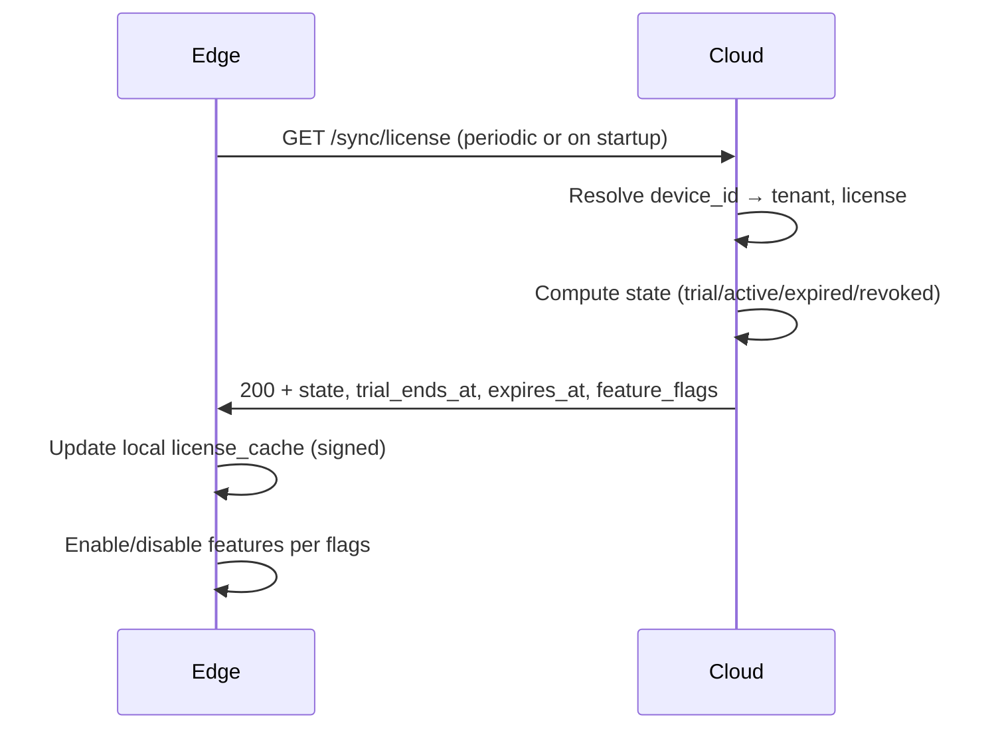

# License Engine Logic

## 1. States

| State | Meaning | Edge behavior |
|-------|---------|----------------|
| **trial** | Within 14-day trial | Full features; offline allowed; no payment |
| **active** | Paid subscription valid | Full features; sync; push |
| **expired** | Past expires_at | Restrict: e.g. detection only, no sync; or grace then lock |
| **revoked** | Admin revoked | No sync; local-only minimal mode |

## 2. Trial Rules

- **Start**: First successful device activation (device_id bound to tenant) starts trial for that tenant.
- **Duration**: 14 calendar days from `trial_ends_at` set at start.
- **Offline**: Trial works 100% offline; no internet required for detection/siren.
- **Clock**: When edge is online, server time is used to compute remaining trial; if edge clock is behind, server wins. Backward jump detection can shorten or flag trial.
- **Single trial per tenant**: One trial per tenant (by tenant_id); re-activation of same tenant does not reset.

## 3. Activation (Paid)

- **Activation key**: Pre-generated key (e.g. in `activation_keys` table) has tier, max_devices, max_phones, feature_flags, valid_until.
- **Redeem**: Client (web/mobile) calls `POST /v1/license/activate` with key → backend creates/updates `licenses` for tenant, binds key (used_at, tenant_id).
- **Device binding**: When edge first syncs with valid license, `license_devices` row created (license_id, device_id). Count must not exceed license.max_devices.
- **Phone cap**: Total users (phones) per tenant must not exceed license.max_phones; enforced in auth and user creation.

## 4. Feature Flags (Tier)

| Tier | fire | theft | multi_site | erp | insurance_report | remote_siren |
|------|------|-------|------------|-----|------------------|--------------|
| BASIC | ✓ | ✗ | ✗ | ✗ | ✗ | ✓ |
| PROFESSIONAL | ✓ | ✓ | ✗ | ✗ | ✓ | ✓ |
| ENTERPRISE | ✓ | ✓ | ✓ | ✓ | ✓ | ✓ |

- **multi_site**: More than one site per tenant.
- **erp**: ERP integration API and webhooks.
- **insurance_report**: Insurance compliance report generation.
- **remote_siren**: Mobile/web can trigger siren remotely.

## 5. Expiry and Renewal

- **expires_at**: Set on subscription purchase/renewal.
- **Warning**: Notify tenant (email/push) at 30, 14, 7, 1 days before expiry.
- **Post-expiry**: State → expired; edge gets 403 on sync; edge applies “offline grace” (e.g. 7 days) then restricts to minimal mode until license is renewed and sync succeeds.

## 6. Edge License Check Flow

- **Offline**: Edge uses cached license; if past expiry + past grace, restrict.
- **403**: Edge treats as expired/revoked; restrict sync and optional features.

## 7. Anti–Clock Tampering (Trial)

- Store `trial_ends_at` in cloud as source of truth.
- On each sync, cloud returns `server_time`; edge can align.
- If edge reports `occurred_at` or local time far in the past compared to previous sync, flag for anomaly (optional: shorten trial or alert).

---

*Next: [Edge Core Spec](../edge/01-edge-core-spec.md)*
