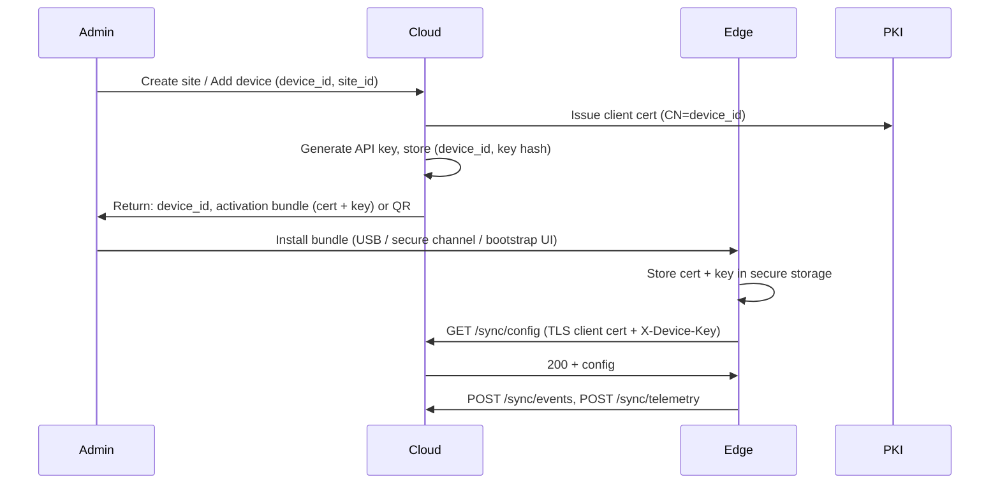

# Edge Device Provisioning & Onboarding

## 1. Overview

- **Goal**: Bind a new edge device to a tenant/site and enable secure sync (TLS client cert + API key).
- **Outcome**: Device has device_id, client certificate, API key, and initial config (or trial).

## 2. Provisioning Flow

## 3. Activation Bundle Contents

- **Client certificate** (PEM): CN or SAN = device_id; validity e.g. 2 years.
- **Private key** (PEM): Never leaves edge after generation or injection.
- **API key**: Single secret for `X-Device-Key` header; stored hashed in cloud.
- **Optional**: CA cert for cloud server pinning; sync base URL.

Bundle can be:
- **Files**: `device.crt`, `device.key`, `api_key.txt`, `sync_url.txt`.
- **Archive**: Encrypted ZIP with password delivered out-of-band.
- **QR / NFC**: Encoded URL or one-time token; edge fetches bundle from cloud once.

## 4. Device ID

- **Format**: Stable unique id (e.g. `EDGE-` + serial, or UUID from factory).
- **Source**: Hardware serial, TPM, or generated once at first boot and stored.
- **Binding**: Cloud maps device_id → site_id → tenant_id; license checks device count per license.

## 5. Trial vs Paid

- **Trial**: Admin creates tenant + site + device in cloud; no activation key. Device gets trial license (14 days) on first sync.
- **Paid**: Admin redeems activation key for tenant; then adds device to site. Device gets active license on first sync.

## 6. Secure Storage (Edge)

- **Linux**: Cert and key in `/etc/riskintel/` (mode 600) or TPM-backed key if available.
- **No key in env or config file in plain text**; use secure storage API (e.g. keyring, TPM).

## 7. Revocation

- **Revoke device**: Cloud marks device as revoked; cert can be added to CRL; next sync returns 403.
- **Revoke tenant**: All devices for tenant get 403; edge restricts to minimal local-only mode after grace.

## 8. Bootstrap UI (Optional)

- First boot: Edge exposes local HTTPS page (e.g. https://192.168.1.1:8443) for “Upload bundle” or “Enter one-time code”.
- Upload: Admin drops bundle file; edge parses and stores cert + key + API key, then restarts sync.
- One-time code: Edge calls cloud `POST /v1/provision/redeem` with code; cloud returns signed bundle URL; edge fetches once over TLS and stores.

---

*Complements [01-threat-model.md](01-threat-model.md) and [02-license-engine.md](02-license-engine.md).*
